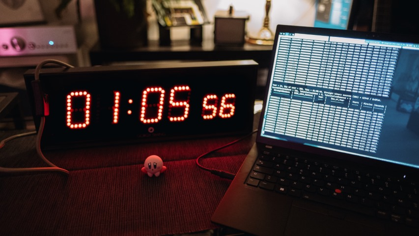
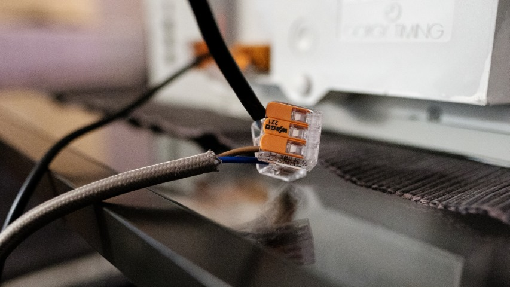
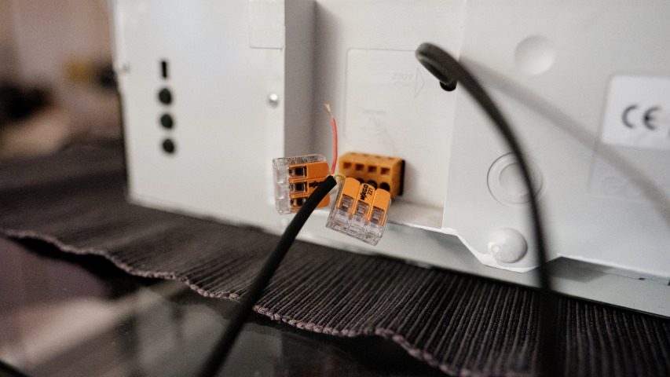

# clockworks



A few years ago a colleague did some dumpster diving and found a bunch of Gorgy
Timing obsolete clocks using broadcast timecode signals to sync.

Without a dedicated network, this clock can't be synced.

Thanks to an obscure and forgotten NTP experimental binary able to generate WWV
or IRIG signals, we can recreate a proper signalisation audio signal to sync the
clock using the audio output port of a computer running linux.

## Requirements

Hardware:

- A trashed clock made for broadcast timecodes (can't help you find one)
- A computer (laptop/embedded/Raspberry Pi...) with an open source distribution
- An inline extension cord (preferably with a switch) to power the clock
- An audio cable you will need to cut (TRS or TS, just two cables are needed)
- 4x connecting dominos if you don't want to do (bad) soldering.

Software:

- docker
- docker-buildx (suggested)
- make
- `¯\_(ツ)_/¯`

## Build (hardware)

Well, ...




You just need to power the clock with a regular 230V cable (or your local
specification).

Same goes for the audio cable, I used a broken Beyerdynamic DT-770 3.5mm TRS
jack for this.

## Build (tg2)

```
$ make all
```

## Run

If you're using pipewire or a recent distribution you may need to enable
snd_pcm_oss kernel module to expose the audio device in `/dev/audio`

Make sure your default audio output is the right one!

```
$ sudo modprobe snd_pcm_oss
$ ./tg2
```

```
$ ./tg2 -h
Time Code Generation - IRIG-B or WWV, v0.23, 2007-02-12 dmw

RCS Info:
  $Header: /home/dmw/src/IRIG_generation/ntp-4.2.2p3/util/RCS/tg.c,v 1.28 2007/02/12 23:57:45 dmw Exp $

Usage: ./tg2 [option]*

Options: -a device_name                 Output audio device name (default /dev/audio)
         -b yymmddhhmm                  Remove leap second at end of minute specified
         -c seconds_to_send             Number of seconds to send (default 0 = forever)
         -d                             Start with IEEE 1344 DST active
         -f format_type                 i = Modulated IRIG-B 1998 (no year coded)
                                        2 = Modulated IRIG-B 2002 (year coded)
                                        3 = Modulated IRIG-B w/IEEE 1344 (year & control funcs) (default)
                                        4 = Unmodulated IRIG-B w/IEEE 1344 (year & control funcs)
                                        5 = Inverted unmodulated IRIG-B w/IEEE 1344 (year & control funcs)
                                        w = WWV(H)
         -g yymmddhhmm                  Switch into/out of DST at beginning of minute specified
         -i yymmddhhmm                  Insert leap second at end of minute specified
         -j                             Disable time rate correction against system clock (default enabled)
         -k nn                          Force rate correction for testing (+1 = add cycle, -1 = remove cycle)
         -l time_offset                 Set offset of time sent to UTC as per computer, +/- float hours
         -o time_offset                 Set IEEE 1344 time offset, +/-, to 0.5 hour (default 0)
         -q quality_code_hex            Set IEEE 1344 quality code (default 0)
         -r sample_rate                 Audio sample rate (default 8000)
         -s                             Set leap warning bit (WWV[H] only)
         -t sync_frequency              WWV(H) on-time pulse tone frequency (default 1200)
         -u DUT1_offset                 Set WWV(H) DUT1 offset -7 to +7 (default 0)
         -x                             Turn off verbose output (default on)
         -y yymmddhhmmss                Set initial date and time as specified (default system time)

This software licenced under the GPL, modifications performed 2006 & 2007 by Dean Weiten
Contact: Dean Weiten, Norscan Instruments Ltd., Winnipeg, MB, Canada, ph (204)-233-9138, E-mail dmw@norscan.com
````

## Raspberry Pi integration

TODO

## Thanks

Ivan B.
Thomas B.
Dean Weiten
